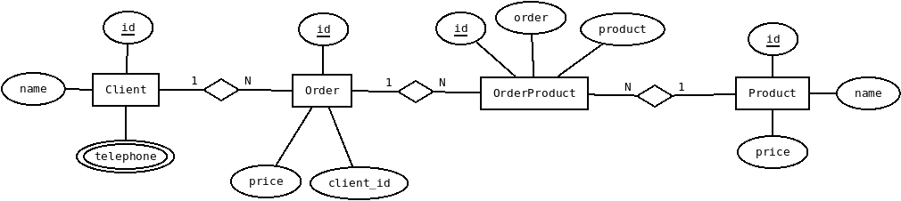
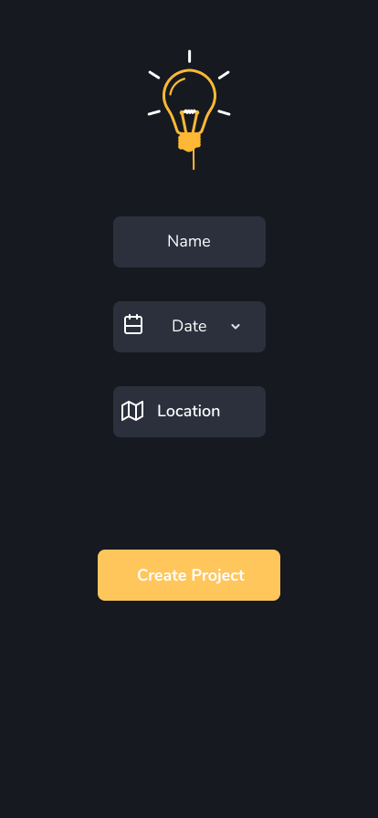
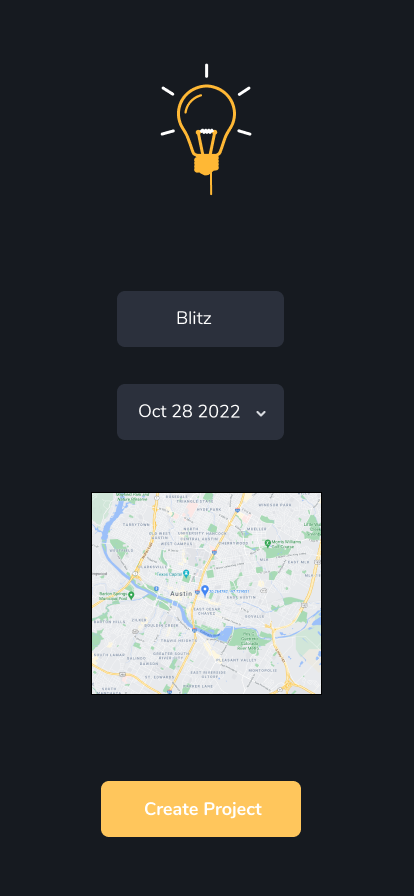
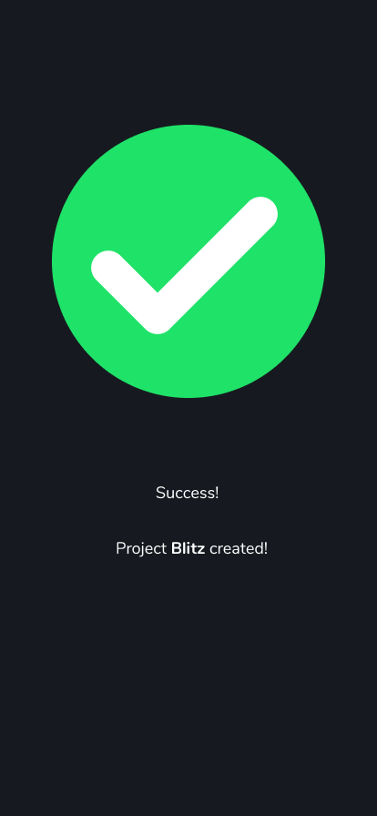

# kaffa-test
## Exercises 1,4 and 5

Requirements

- Package manager: Yarn/Npm;
- React Native(https://reactnative.dev/docs/environment-setup);

Steps

- Use yarn/npm to install dependencies;
- Start the app with: 'npx react-native start' or 'yarn start';
- Compatible plataforms :
  - Emulator:
    - Android Studio(https://developer.android.com/studio).

## Exercise 6

Requirements

- Package manager: Yarn/Npm;
- Node.js(https://nodejs.org/en/)

Steps

- Use yarn/npm to install dependencies;
- Go to src > NumberSix;
- Start the server with: 'node src/index.js'.
- Open browser in: http://localhost:3333/

## Exercise 7

## Exercise 8

